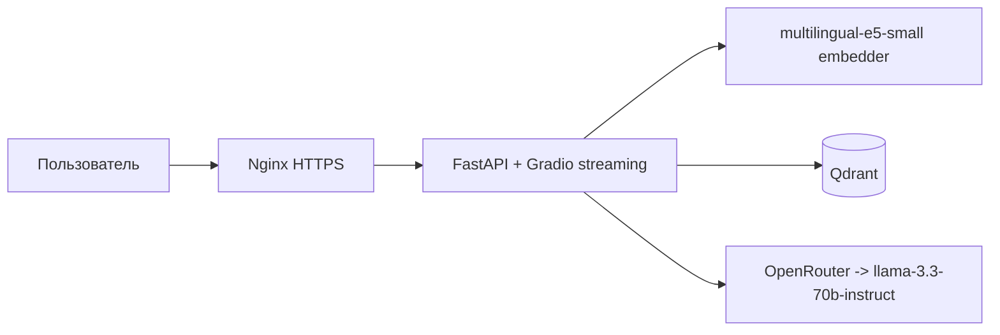

# scikit-learn docs RAG assistant

AI-ассистент по официальной документации scikit-learn. Задаёте вопрос
на естественном языке (английском или русском) — получаете ответ с цитатами из документации.

Живой сервис: https://130-49-143-10.nip.io (Swagger: [/docs](https://130-49-143-10.nip.io/docs))

## Архитектура



## Метрики

Замеры на реальной системе (10 вопросов golden dataset: 7 EN, 2 RU, 1 мета-вопрос;
3 sklearn-модуля + about.md → 265 чанков, llama-3.3-70b-instruct,
[`notebooks/rag_eval.ipynb`](notebooks/rag_eval.ipynb)):

| Метрика | Значение | Что измеряет |
|---|---|---|
| Recall@4 | **1.00** | retriever возвращает URL из нужного раздела документации во всех 10 случаях |
| Faithfulness | **0.86** | LLM-судья: ответ не противоречит контексту |
| Response Relevancy | **0.94** | LLM-судья: ответ по делу, не уходит в сторону |

Судья RAGAS — та же llama-3.3-70b-instruct. Recall@4 считается по совпадению раздела
(`linear_model` / `tree` / `model_evaluation`) в URL источника, а не конкретного фрагмента.
Итоговые значения: [`notebooks/rag_metrics.json`](notebooks/rag_metrics.json).

### Эксперимент: reranker

Между retriever'ом и сборкой контекста добавлен cross-encoder `cross-encoder/ms-marco-MiniLM-L-6-v2`:
retriever достаёт top-20 чанков, cross-encoder заново оценивает каждую пару «вопрос — чанк»,
и в контекст LLM попадают 5 лучших.

| Метрика | Без reranker (top-4) | С reranker (top-20 → top-5) | Δ |
|---|---|---|---|
| Recall | 1.00 | 1.00 | 0 |
| Faithfulness | 0.86 | **0.90** | +0.04 |
| Response Relevancy | 0.94 | 0.94 | 0 |

- **Faithfulness выросла на 0.04**: с переоценённым контекстом ответы чуть точнее опираются на источники.
- **Response Relevancy и Recall не изменились.** Recall и без reranker'а был 1.00.
- **Цена**: ещё одна модель в памяти (~90 МБ весов) и 20 пар на прогон cross-encoder'ом при каждом запросе.

Включить: `RERANK_ENABLED=true` в `.env`. Параметры: `RERANK_MODEL`, `RERANK_FETCH_K` (по умолчанию 20),
`RERANK_TOP_N` (по умолчанию 5). Результаты: [`notebooks/rag_metrics_rerank.json`](notebooks/rag_metrics_rerank.json).

## Локальный запуск

Нужен ключ OpenRouter (или любого OpenAI-совместимого провайдера):

```bash
echo "LLM_API_KEY=<ваш ключ>" > .env
python -m venv venv && source venv/bin/activate
pip install -r requirements.txt

# 1. Qdrant
docker compose up -d qdrant

# 2. Корпус и индекс (с хоста Qdrant доступен на localhost)
python -m app.scripts.load_corpus
QDRANT_URL=http://localhost:6333 python -m app.scripts.index_corpus

# 3. Сервис
docker compose up -d app
```

Откройте http://localhost:8001 — чат, http://localhost:8001/docs — Swagger.

Тесты: `pytest` (цепочка RAG замокана, Qdrant и LLM не нужны).

## Кратко о проекте

> RAG-сервис над документацией scikit-learn на FastAPI + LangChain
> LCEL + Qdrant + multilingual-e5-small. Streaming-чат в Gradio
> (chain.stream), оценка качества через RAGAS на golden dataset
> (Recall@4 1.00, Faithfulness 0.86, Response Relevancy 0.94),
> A/B-проверка cross-encoder reranker'а (Faithfulness 0.86 → 0.90).
> LLM-провайдер абстрагирован через OpenAI-совместимый endpoint —
> меняется одной правкой `app/config.py`. CI/CD: GitHub Actions → GHCR → VPS.
